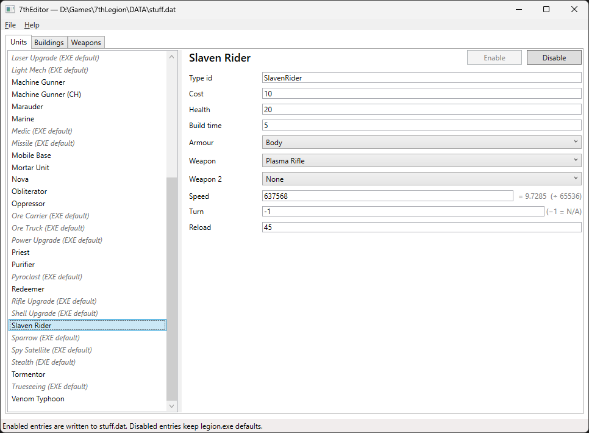

# Introduction

7thEditor is a unit stat editor for 7th Legion, the 1997 RTS by Vision Software. The app uses [iiEighthSolitude](https://github.com/btigi/iiEighthSolitude) to manipulate the STUFF.DAT file, allowing changing of basic unit stats.




## Compiling

```
# Clone this repository
$ git clone https://github.com/btigi/7thWorld

# Go into the repository
$ cd src

# Build  the app
$ dotnet build
```

## Notes

The game has several cut units, 7thEditor allows the stats on these units but doesn't restore any functionality to the game around these units.


# Licencing

7thWorld is licenced under the MIT license. Full licence details are available in license.md